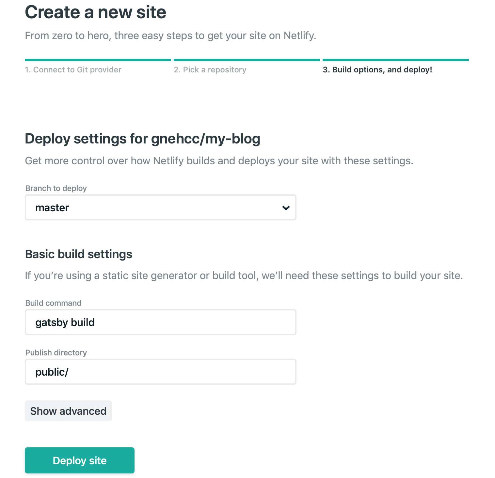

圣诞节长假回来工作清闲，想着要不把以前放在简书上被荒废的博客Replicate过来搭一个自己的小站，顺带把这一小块地方也用起来。
简书上的博客正好以前就是用markdown写的，非常方便就能导出来。正好被微软收购GitHub前段时间开放了免费无限私有Repo的功能，虽然有一些比如像是协作人数数量的限制，不过用来放置自己博客相关的内容也完全绰绰有余了，新建一个私有的repo用来管理这些资料也更加好track。

### 准备
有了一个大致的想法后，去网上搜罗了一堆用来搭建的工具:
- Repo：Github private repo
- 框架：因为先前写的一些博文都是markdown格式，也会一直采用下去, 所以选择静态站点生成工具也就顺理成章了，省时省力对托管服务要求也简单。现在比较火的主要有像是Jekyll，Hexo，Gatsby, Hugo等等，考虑到现在的工作天天在码Javascript,而且想顺带了解一点react和GraphQL的东西和方便以后自己扩展，gatsby似乎是个不错的选择。
- 托管服务：静态站点托管的选择也很广，从最基础的自己买服务器到借助各家云的存储以及一些专门的站点托管服务。纵向比较的话，都9021了，站点托管服务当然是最无脑简便的选择，一站式解决方案也不用管各种底层的配置。横向比较的话，类似的产品有netlify，git pages， heroku等等，gitpages对jekyll的支持相对来说更适合一点，几年前使用过heroku的服务，配合官方的CLI也没什么可挑剔的，但试着尝新看了看netlify的介绍：和github集成，自动部署，自定义域名以及HTTPS支持
- 域名：域名服务看了一圈，像godaddy或者google domain，按自己喜好选择就行。

### 新建项目
因为使用gatsby，大前端的一套全家桶基本怕是得都装上去了，至于如何搭建node开发环境和安装gatsby可以具体去google/bing，有几个小tips：
- 可以使用像是[nvm](https://github.com/creationix/nvm)这样的工具在本机管理多个node版本。
- 如果使用Mac的话，安装一些像Homebrew的工具也能让生活轻松不少。
- Gatsby有很多现成的[starter template](https://www.gatsbyjs.org/starters/?v=2)，作为快速把blog整起来是不错的起点，之后再根据需要调整和增加想要的功能。
- 因为Static site generator的特点，markdown文件的格式/内容可能需要依据相应的template增加一些manifest头信息和做一些微调，具体可以参考一下sample
- 利用Git做好版本管理。

### 本地调试
通过模版生成的项目框架已经将各种需要的配置都已经准备好，一般来说将博文内容准备好了，利用现有的npm/yarn script就能非常方便的在本地调试，如果你用的是gatsby的话基本上已经有现成的像`gatsby develop`命令在本地serve项目查看运行结果。

### 给静态站点添加评论
因为静态站点的内容都是通过markdown文件渲染出来的，也就没法像老的方法一样用数据库家后端服务的方式来处理评论，好在有很多第三方的服务来满足这样的需求，[disqus](https://disqus.com)算是其中使用最多的一个吧，方便集成，多语言支持，同时也提供了丰富的管理功能。按照官方文档一步步建好自己site就好。
集成到react/gatsby的时候：
- 利用现有的library[disqus-react](https://github.com/disqus/disqus-react)，几行代码就能解决
- 自己写一个也很方便：
    ```javascript
    export class Disqus extends React.Component {
        render() {
            return <div id="disqus_thread" />
        }

        componentDidMount() {
            const doc = window.document
            window.disqus_config = this.getDisqusConfig(this.props.config)
            var scriptNode = doc.createElement('script')
            scriptNode.src = `https://${this.props.shortName}.disqus.com/embed.js`
            scriptNode.setAttribute('data-timestamp', +new Date())
            doc.body.appendChild(scriptNode)
        }

        getDisqusConfig(config) {
            return function() {
            this.page.identifier = config.identifier
            this.page.url = config.url
            this.page.title = config.title
            }
        }
    }
    ```
注意集成disqus的时候，按照文档配置好相应的参数就好。

### 托管到Netlify
Netlify和github集成的非常好，用你的github账号login和authorize之后直接就能通过直接读取你的git repo来生成站点，而且对gatsby的支持也非常友好，所有的配置都能自动检测：


### 设置域名，DNS和开启HTTPS
档deploy好站点之后接下来要做的就是去购买的域名管理后台，设置好域名要解析到的真实服务器（netlify一般会随机设置），以及开启HTTPS，不同的域名服务商的设置后台应该大同小异。

### 自动部署
当站点上线之后，任何的更改一旦push到github repo之后，netlify就会自动开始build，一个的blog的自动更新部署也就是分钟内就能完成的事，整个过程美好到不行。


**参考资料：**

> https://www.staticgen.com/

> https://www.gatsbyjs.org/docs/

> https://disqus.com

> https://www.gatsbyjs.org/starters/?v=2

> https://github.com/creationix/nvm

> https://app.netlify.com